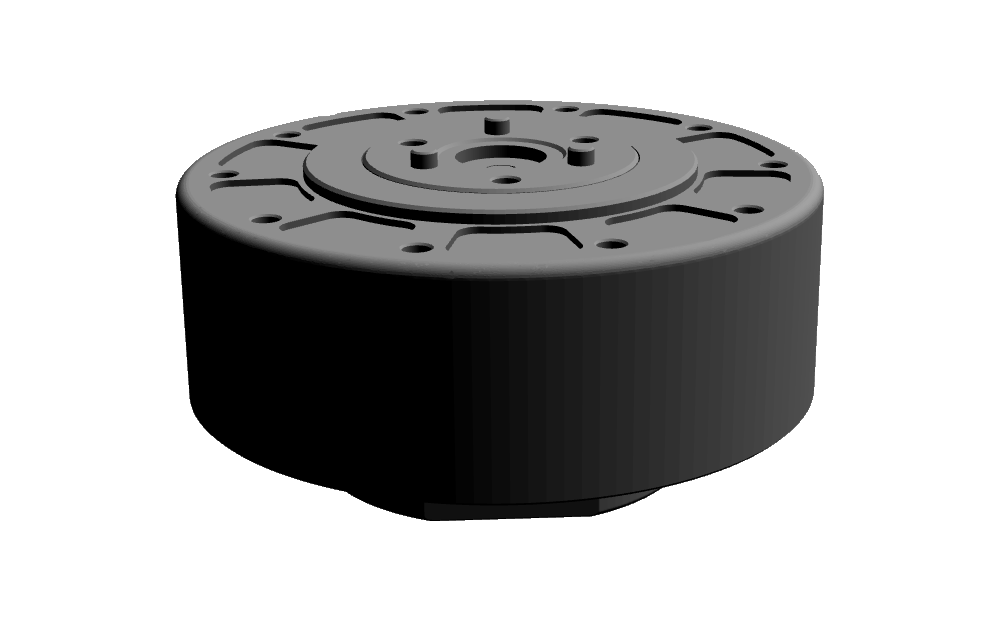

# MyActuator RMD X-series ROS 2

Author: [Tobit Flatscher](https://github.com/2b-t) (2024)

[](https://opensource.org/licenses/MIT)


## Overview
This repository holds the **URDF models** and [**`ros2_control` integration**](https://control.ros.org/humble/index.html) for the [**MyActuator RMD-X actuator series**](https://www.myactuator.com/rmd-x). The CAD models for the URDF models were obtained from the [offical MyActuator RMD web page](https://www.myactuator.com/downloads-x-series). The hardware interface is based on the [C++ driver that I have written for these actuators](https://github.com/2b-t/myactuator_rmd).

You will need to clone both of the repositories to your ROS 2 workspace (e.g. `~/colcon_ws/src`):

```bash
$ git clone https://github.com/2b-t/myactuator_rmd.git
$ git clone https://github.com/2b-t/myactuator_rmd_ros.git
```

The first contains the C++ library as well as the Python bindings, the second the `ros2_control` integration and CAD models. Install the package dependencies with `$ rosdep install --from-paths src/ --ignore-src -r -y` (potentially you also have to [follow these instructions for installing the C++ library's dependencies](https://github.com/2b-t/myactuator_rmd/blob/main/ReadMe.md)) and proceed to build your workspace with `$ colcon build --symlink-install`.

For more information regarding the individual packages inside this repository please refer to their corresponding individual read-mes.


