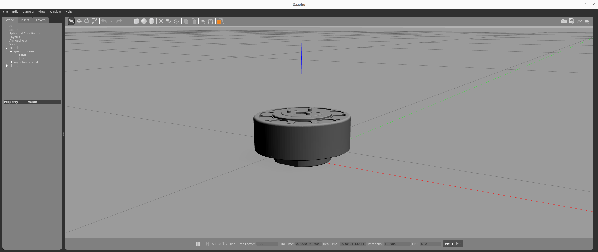

# MyActuator RMD X-series Bring-up

Author: [Tobit Flatscher](https://github.com/2b-t) (2024)

[](https://opensource.org/licenses/MIT)


## Overview
This package contains the **ROS 2 bring-up and configuration files** for the [MyActuator RMD X-series actuators](https://www.myactuator.com/rmd-xplanetary-motor).

For **launching the actuator in simulation** with `ros2_control` simply launch the following launch file specifying the actuator:

```bash
$ ros2 launch myactuator_rmd_bringup myactuator_rmd_control.launch.py actuator:=X8ProV2 simulation:=true
```

Additionally to RViz and Gazebo this should open up a GUI for the controller manager as well as another GUI for the joint trajectory controller. In the latter you can activate the `joint_trajectory_controller` and move the actuator with it.


