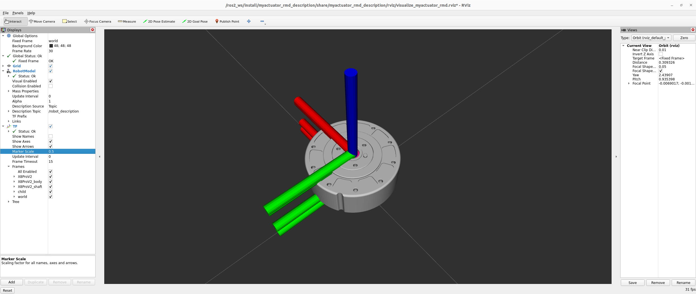

# MyActuator RMD X-series Description

Author: [Tobit Flatscher](https://github.com/2b-t) (2024)

[](https://opensource.org/licenses/MIT)


## Overview
This package contains **URDF descriptions of the [MyActuator RMD X-series actuators](https://www.myactuator.com/rmd-xplanetary-motor)**. The CAD models were downloaded from the [official MyActuator webpage](https://www.myactuator.com/downloads-x-series). Unfortunately the drawings provided by MyActuator are not consistent with their origins and had to be manually adjusted. For more information on this refer to the [corresponding read-me](./doc/UpdateCadModel.md).

For visualizing a particular actuator use the following command where the actuator corresponds to the names of the actuator xacro files inside the `urdf/` folder.

```bash
$ ros2 launch myactuator_rmd_description visualize_myactuator_rmd.launch.py actuator:=X8ProV2
```

This should open an RViz preview as well as the joint state publisher GUI that allows you to move the joint of the actuator.


