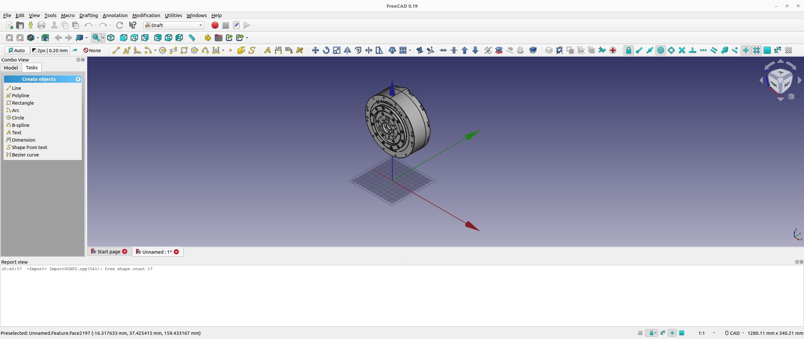
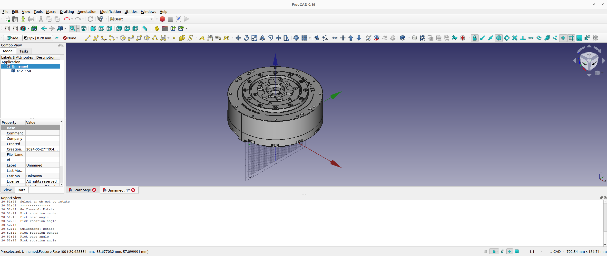
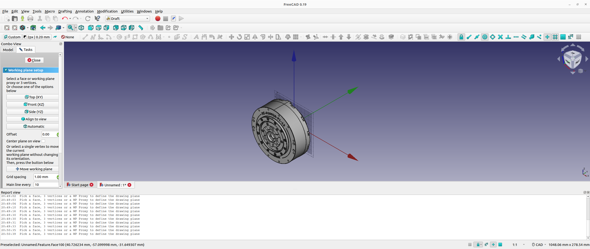
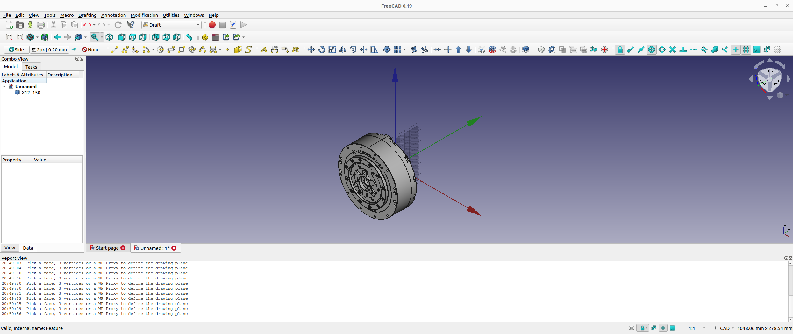
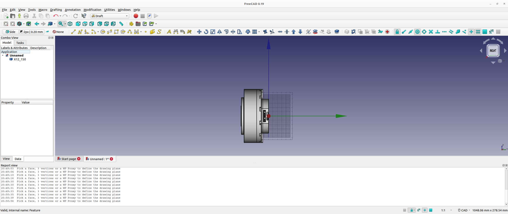
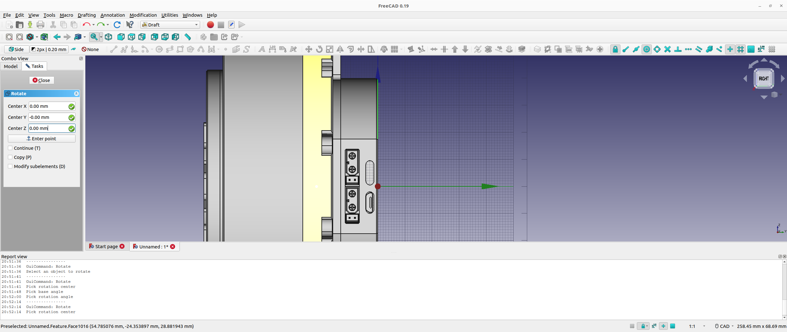

# Update CAD Model with FreeCAD

Author: [Tobit Flatscher](https://github.com/2b-t) (2024)


Unfortunately the CAD models provided by MyActuator use different file formats and are not consistent with their origins. For using them with ROS they have to be **converted to a compatible format** such as COLLADA (`*.dae`) and the **origins have to be adjusted**. The convention that I am using makes the **origin coincide with the center of the back plate with the z-axis pointing along the actuator**. I have manually adjusted the CAD models just for a few actuators so far. In case you need another model of actuator that this was not done so for so far, this guide explains how this can be done with the open-source software [FreeCAD](https://www.freecad.org/).

|  |  |
| ---------------------------------------------------- | ------------------------------------------------ |
| Before alignment (as provided by MyActuator)         | After alignment for URDF                         |

In case you are porting another actuator model please [open a pull request](https://github.com/2b-t/myactuator_rmd_ros/pulls) when you are done so that everyone can make use of it, thanks!


### Installing FreeCAD

FreeCAD is an open-source CAD program that can be downloaded for free from [their webpage](https://www.freecad.org/downloads.php). In the case of Ubuntu it can be installed with `apt` as follows:

```bash
$ sudo apt-get install freecad
```

Then continue to load the provided STEP or STL models into FreeCAD.

### Adjust the origin and orientation of the CAD model

For performing the changes **switch to draft view** by selecting it from `View/Workbench/Draft`. Then continue to **move the actuator to the coordinate origin** by selecting the actuator model on the left-hand side, selecting the move command, then the back of the actuator and finally the coordinate origin. Be sure that the snap on center option is activated. A small video outlining this can be found [here](https://www.youtube.com/watch?v=wdb-THGK88Y).

|  |  |
| ---------------------------------------------- | ------------------------------------------------------------ |

Then we will have to align the actuator with the z-axis. For this **select the [correct draft plane](https://wiki.freecad.org/Draft_SelectPlane)** and perform a rotation inside that plane.

|  |     |
| ------------------------------------------------------------ | ------------------------------------------------- |
|              |  |

Finally **export the model as COLLADA** (`*.dae`).

### Editing the Xacro and launch files

After editing the CAD file and saving it as a COLLADA file, create a new Xacro using the model name, e.g. `urdf/X12_150.xacro`, for the actuator **modifying the dimensions of the three different segments of the collision cylinders** as well as the **mass**. The dimensions can be obtained from the PDF files inside the `meshes/visual/` folder. The mass can be found online on the web page or inside the data sheets. The inertia is automatically estimated from the mass and the dimensions of the different segments assuming uniform density.

```xml
<?xml version="1.0"?>
<robot xmlns:xacro="http://www.ros.org/wiki/xacro">
  <xacro:include filename="$(find myactuator_rmd_description)/urdf/myactuator_rmd.xacro"/>

  <!-- Provide dimensions for specific actuator -->
  <xacro:macro name="" params="name parent_link child_link joint_name simulation ifname actuator_id">
    <xacro:myactuator_rmd name="${name}" parent_link="${parent_link}" child_link="${child_link}"
                          joint_name="${joint_name}" simulation="${simulation}"
                          ifname="${ifname}" actuator_id="${actuator_id}"
                          visual="$(find myactuator_rmd_description)/meshes/visual/X12_150/X12_150.dae"
                          radius_1="0.04"  height_1="0.0136"
                          radius_2="0.062" height_2="0.0435"
                          radius_3="0.043" height_3="0.007" mass="1.3"/>
  </xacro:macro>

</robot>
```

In order to preview the actuator with this package we will also have to adapt the standalone preview file `standalone.urdf_xacro`, adding another conditional statement for our actuator similar to the snippet below:

```xml
<xacro:if value="${actuator_model == 'X12_150'}">
  <xacro:include filename="$(find myactuator_rmd_description)/urdf/X12_150.xacro"/>
  <xacro:X12_150 name="X12_150" parent_link="${parent_link}" child_link="${child_link}" joint_name="${joint_name}"
                 simulation="$(arg simulation)"
                 ifname="$(arg ifname)" actuator_id="$(arg actuator_id)"/>
</xacro:if>
```

Finally we will have to also adapt all of the launch files inside the packages adding another choice for `actuator_cmd`:

```python
actuator_cmd = DeclareLaunchArgument(
    actuator_parameter_name,
    choices=['X8ProV2', 'X12_150'],
    default_value='X8ProV2',
    description='Type of the actuator'
)
```
